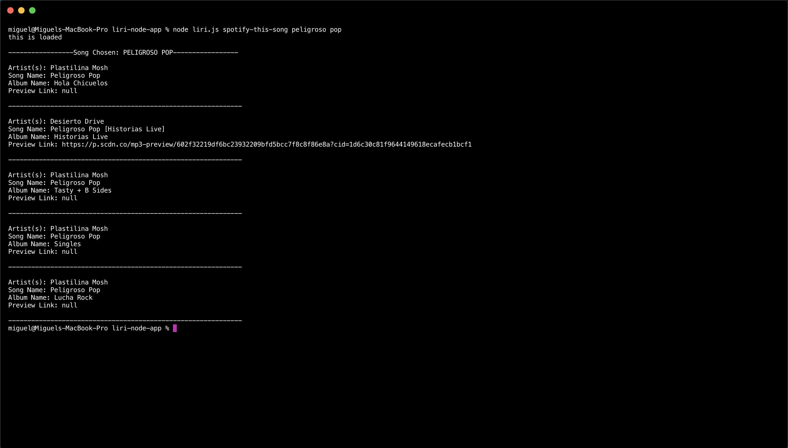
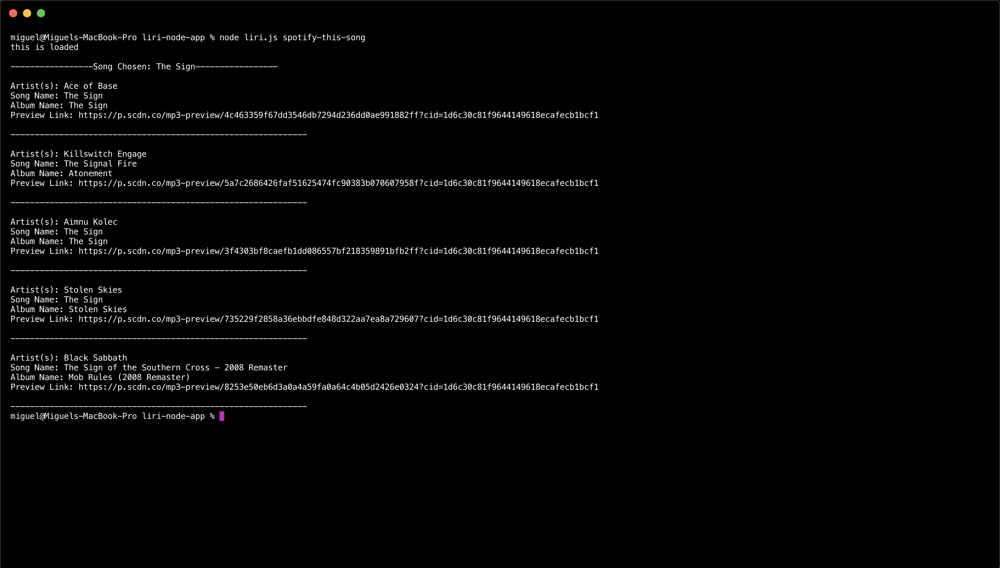
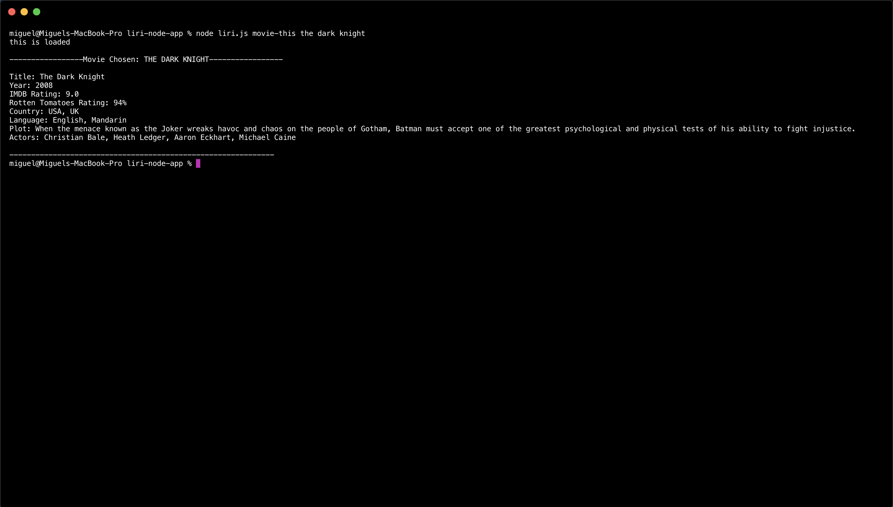
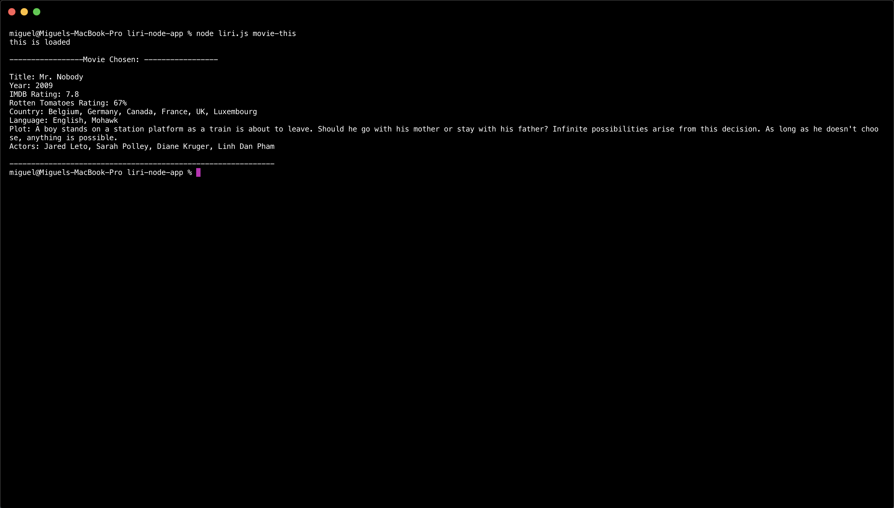
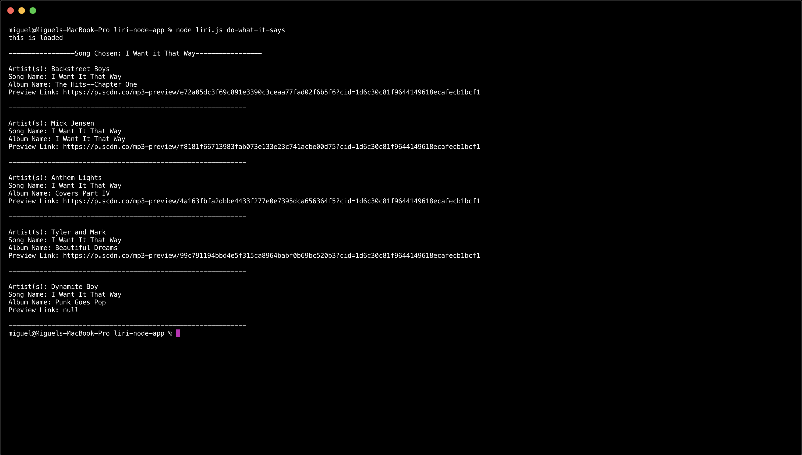

# Project Title 
LIRI Bot
# Overview
LIRI is like iPhone's SIRI. However, LIRI is a Language Interpretation and Recognition Interface. LIRI will be a command line node app that takes in parameters and gives you back data.  
LIRI will search Spotify for songs, Bands in Town for concerts, and OMDB for movies.

# Preview: concert-this 

# Preview: spotify-this-song 

# Preview: spotify-this-song blank 

# Preview: movie-this

# Preview: movie-this blank

# Preview: do-what-it-says

# Preview: Video
  * Preview video is in assets folder named: preview

# Link to GitHub Repository
  * [liri-nod-app](https://github.com/mcelis025/liri-node-app)

# How to Use (Instructions)
 1. Clone my repo into your computer using
   * git clone https://github.com/mcelis025/liri-node-app.git
 2. In your command/terminal/bash type:
   * npm install
 3. Create a file named .env, add the following to it, replacing the values with your API keys (no quotes) once you have them:
    * 
    `# Spotify API keys

     SPOTIFY_ID=your-spotify-id
     SPOTIFY_SECRET=your-spotify-secret`
4. In your command/terminal/bash type:
  * node liri.js concert-this "add your artist"
  * node liri.js spotify-this-song "add your song or leave blank"
  * node liri.js movie-this "add your movie or leave blank"
  * node liri.js do-what-it-says

# Resources Used
  * Node JS
  * JQuery
  * npm 

# NPM Used
  * Axios
  * Moment
  * DotEnv

# APIs Used
  * Node-Spotify-API
  * Bands In Town API
  * OMDB API
  
# Versioning 
  * GitHub

# Authors
  * Miguel Celis
